# An Adventure in Pre-Rendered Backgrounds

Programmer: [Justin Meiners](https://github.com/justinmeiners) 

3D Artist: [Hunter Rassmussen](https://github.com/HunterRasmussen)

Source Code: [Github Repo](https://github.com/justinmeiners/pre-rendered-backgrounds)

## Contents

1. [History](#history)
2. [Prototype](#prototype)
3. [Engine](#engine)
4. [Perspective](#perspective)
5. [Depth](#depth)
6. [Shadows](#shadows)
7. [Reflections](#reflections)
8. [Scripting](#scripting)
9. [Backgrounds](#backgrounds)
10. [Character](#character)
11. [The Future](#thefuture)
12. [Additional References](#additionalreferences)

## History

In the summer of 2017, Hunter and I (Justin) wanted to make a game together. Since we still had jobs (and needless to say, a very limited amount of time), we set a goal to make as simple a project as possible, with just two characters, one level, and point-and-click game mechanics.

The inspiration for our game came from a rendering technique which was popular in the mid-1990s on the PlayStation and, to a lesser extent, the Nintendo 64. Instead of rendering a full 3D environment in-game, artists would create still-images of the scenery offline. The game would then draw interactive 3D objects on top of this static background. The characters and objects could move around freely, but of course, the background would remain fixed for each scene. 

This technique was used at the time because of the limitations of the graphics hardware. Since the scenery didn't need to be rendered in real-time the artists could put a lot more detail into them, and use sophisticated rendering software which was usually reserved for films. This also freed the graphics hardware to focus entirely on the characters and a few other objects in each scene.

If you know anything about traditional hand-drawn animation, you know that something similar is often used. Since it would be too time consuming to redraw an entire scene for every frame of a film, animators paint a backdrop and only redraw the characters and moving objects on top. Although this likely inspired pre-rendered backgrounds, the motivations and methodologies are actually very different. I will discuss this more later on.

Below are examples of games that used the pre-rendered background technique.

#### Final Fantasy VII

The backgrounds of Final Fantasy are beautiful and often feature small animated pieces to avoid appearing too flat and static. You can view a large [gallery of backgrounds here](https://imgur.com/a/shRaP). [This document](http://q-gears.sourceforge.net/gears.pdf) also contains a detailed analysis of how the FF7 engine works.

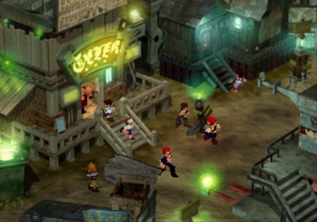

#### Resident Evil

Resident Evil leveraged the limitations of pre-rendered backgrounds to its advantage. Because the designers had full control of the camera, they were able to craft some cinematic and [scary scenes](https://youtu.be/N92RAQ3mvMA?t=3138) which weren't possible using other techniques. The later games in the series moved to a free camera and full 3D environments and subsequently transformed from horror games into action games.

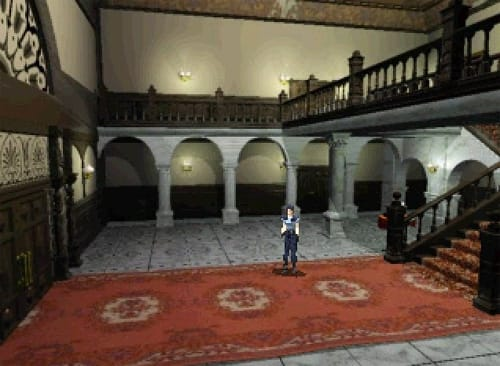

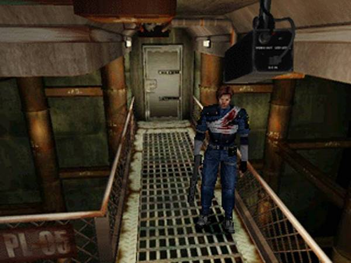


#### Zelda: Ocarnia of Time

Ocarina of Time isn't known for this technique, because it only uses pre-rendered backgrounds in a [few scenes](http://wiki.spinout182.com/w/Zelda_64:_JFIF_Backgrounds), such as inside Link's house and outside the Temple of Time. Unlike the other games, it is not clear to me why this technique was included at all. Perhaps it allowed them to create impressive looking vistas, but this didn't seem to be a limitation outside of Ganon's castle. Another possibility is it allowed the team to produce these scenes faster.

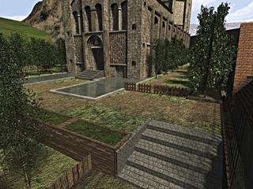 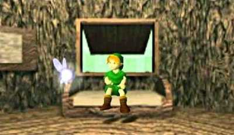

## Prototype

We thought that this technique had a lot of charm, and had not been utilized since this time. With modern hardware, we could push the original motivations even further, by having even more detailed backgrounds and characters. 

With this idea for an engine, we thought about what kind of game would make sense. I really like the original [Alien movie](https://en.wikipedia.org/wiki/Alien_%28film%29) and thought it would match well with a slower paced exploration and adventure game. What if the entire game was just you and an Alien stuck on a ship? As you try to stay alive on the ship, you solve puzzles and face the alien in various encounters.

This concept art already looks like a possible scene in the game.

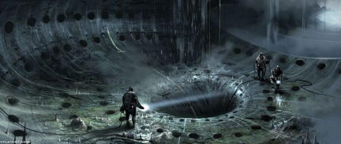

The screenshots below show the final demo. The astronaut walks anywhere you click on the floor. He can also interact with objects, such as switches, by clicking on them (they are invisible for testing purposes). As the astronaut moves offscreen, the camera swaps to another view to follow him. The demo has only one scene: the astronaut's sleeping quarters, with 3 small rooms in this area.

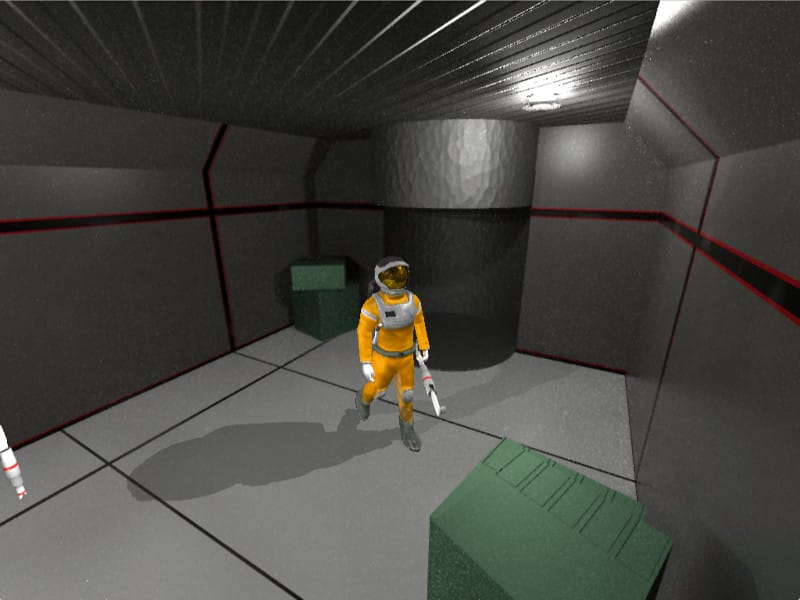

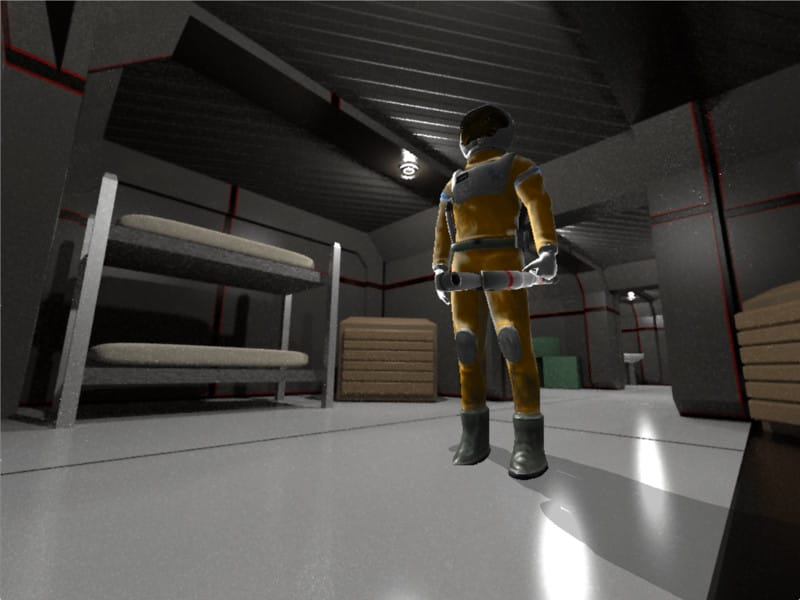


 We didn't get close to our vision for the small game and finished the summer with only one character, and almost no gameplay. This is mostly due to how long it took for us to create artwork, even at placeholder quality. 

What we did accomplish is create a vertical slice of the engine that answers the critical artistic and technical questions, such as, "what goes into making a scene?" "how big should the player be?" "how should sound combine with scenes?". Whenever you create a new system, there are millions of tiny questions that need to be answered about how the parts should fit together, or which approach should be taken in a particular circumstance. This is one of the tough parts of doing something new. I am confident that our prototype achieves this and prepares the project to move into the phase of scaling horizontally and producing more content.

In the rest of this article, we will review some of the questions we faced and explain our solutions for them. 

## Engine

I adapted an engine I had written for a [previous game](https://justinmeiners.github.ioshamans_history.html). It is written entirely in C and targets OpenGL ES 2.0 & OpenGL 3.2 hardware (macOS, iPad, etc). This generation of OpenGL APIs focused on a fully programmable fragment and vertex stage, but do not yet support geometry and tessellation shaders.

The primary purpose of the engine is to load and manage 3D assets and is largely flexible in regards to programming the actual gameplay. Most of the asset formats are entirely custom and have custom export scripts for Blender. It also supports [OBJ](https://en.wikipedia.org/wiki/Wavefront_.obj_file) for prototyping static models. I am especially proud of the skeletal animation system inspired by Doom 3's  [MD5 file format](http://tfc.duke.free.fr/coding/md5-specs-en.html). The system is very simple, and flexible, for attaching items to bones or writing parametric driven animations. The skinning is also computed entirely on the GPU.

The engine is divided into systems, each with their own responsibilities:

- SndSystem

- ScriptSystem

- PartSystem

- GuiSystem

- NavSystem

- RenderSystem

- InputSystem

I tried to keep them decoupled, but it was not helpful to try and make them entirely independent. The engine calls into most of the systems, but, for example, GuiSystem may call some functions of InputSystem.

I like plain C quite a bit, especially for games. One reason I find it so productive is that it forces you to solve concrete problems in the [simplest possible way](http://wiki.c2.com/?DoTheSimplestThingThatCouldPossiblyWork). When you approach a new feature, it is pretty clear what you need to do. You think about what structs are needed to represent data, and what functions you need to operate on them and you write them. In Boost style C++, I find myself thinking more about the general cases, rather than the one I actually need to solve. Don't get me wrong, but I still love that style of programming, but it isn't the best solution for every problem.

Abstraction and generalization are still possible in C, but they aren't the default. You create them as needed. For example, the OpenGL render and sound driver are entirely abstracted away from the rest of the code. Both are defined as [structs of function pointers]() which are implemented for each desired API. This makes it much easier to support multiple platforms.

## Perspective

For pre-rendered backgrounds to function in the game, they must match the visuals of the real-time objects, *and* the gameplay in the scene. If the characters are drawn with a different camera angle or perspective than the camera, they won't look like they are actually there. The characters will look they are standing on top of a scene, rather than being inside it. If what the player sees on the screen doesn't match what is actually happening, then they will have a frustrating experience. In other words, the walls and barriers in the background should behave like walls and barriers to the player.

We can summarize this by saying, *The closer the pre-rendered backgrounds match the game the more they will feel a part of the game*.

With this principle in mind, we want to include as many connections between the two as possible. In our game, we accomplished this by matching the coordinate systems in Blender and the game exactly. Both the pre-rendered background and the game level are edited together, keeping everything in sync.

**Blender camera view**

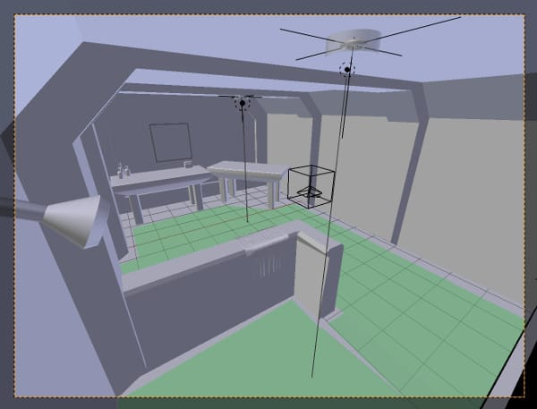

**in-game camera view**

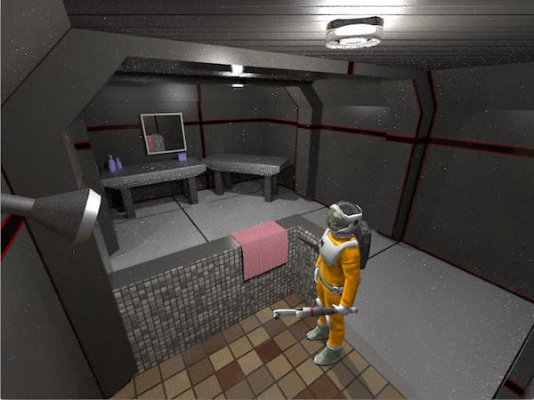

The scenes are modeled in Blender in full detail with materials and lighting. After the scene is complete, *then* we can begin placing cameras at viewpoints of interest, making sure that the cameras can see every area that the player can walk.

Our thinking here is that we want the scenes to look good from all angles. This allows us to adjust camera angles freely. 
It also removes the temptation to create a "false view" for one camera, which isn't accurately depicted by the others. This strategy could be extended to the whole game. Instead of creating the game scenery in pieces, you could model the entire ship coherently, an then add in cameras and games objects.

A navigation mesh is tailored to fit the floor and represents the playable or walkable area. Unlike the scenery, this navigation mesh exists in the actual game and is used to move the characters. Each edge of the navigation mesh can be flagged with attributes, such as whether the edge is a wall or just an area that the player cannot walk (like a hole).

**Scene in blender**

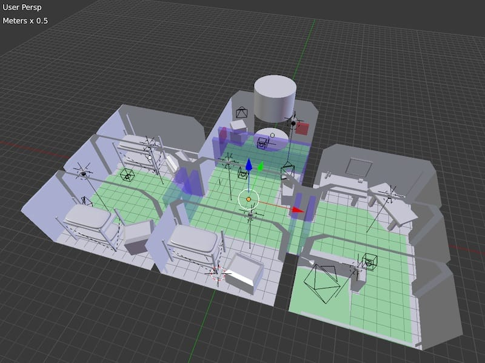

When a scene is exported from Blender, the coordinates of all the cameras and game objects are recorded, along with the navigation mesh. These are loaded into the actual game simulation. As the player walks around the navigation mesh and leaves the view of one camera, the in-game camera swaps to another, and the background swaps with it. The game simulation stays continuous during camera changes. During major scenery changes, the game may not be continuous as the game loads a new area, but this is not shown in this demo.

In the screenshot below, the only things that exist in the actual game are the wireframes, the player. The large gray boxes are triggers which swap the camera when the player walks into them.

**Hidden objects**

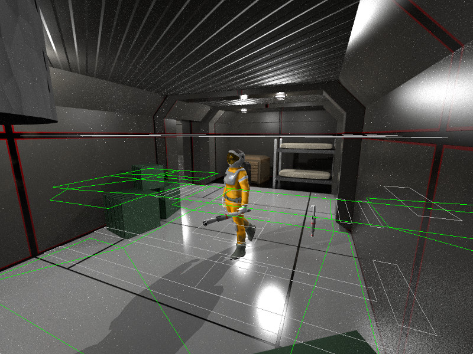


With all the components together a scene is composed of:

1. Coordinates of game objects, lights, and cameras.
2. Lens settings for each camera such as field of view and near/far planes.
3. A color and depth image for each camera.
4. A cubemap for each reflection probe.
5. Navigation mesh.
6. Level script.

I will discuss each of these in more detail.

## Depth 

Earlier, I gave the impression that the characters were drawn *on top* of the backgrounds, as if they were backdrops, like in old Disney movies. But, unlike a movie, games don't have control over all the objects in the scene. In a game, you also need to consider depth. What happens if the player walks behind an object?

**Snow White**

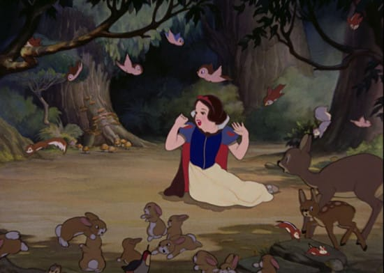

I initially wondered if this could be resolved by dividing the pre-rendered images into two layers: foreground and background. The foreground would always be drawn last, over top of the interactive objects.

I did a test render to try it out. (Yes, the artwork is awful!)

**Background & Foreground**

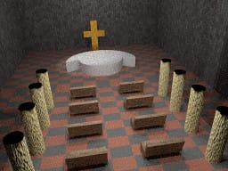 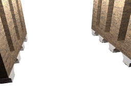

**Combined**

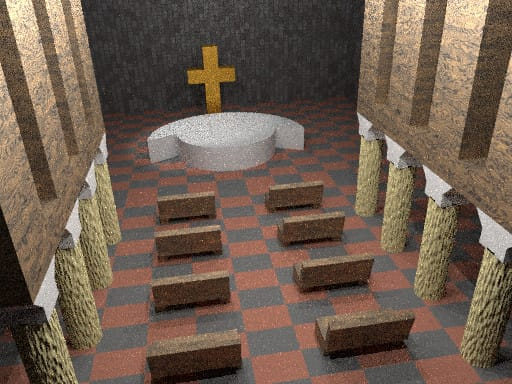

Although this works well for the foreground structure, you can see right away that this comes with a lot of restrictions. What about the columns and benches? 
Can't the player walk in front of and behind those? Clearly, a column cannot be safely assigned to either layer *unless you force the player to only walk on one side of it*.

One could design a game around this layering system, but it would require a lot of tedious planning to make sure that you never had objects that could be walked in front of and behind. 
Final Fantasy VII actually does something similar, as explained in the [analaysis](http://q-gears.sourceforge.net/gears.pdf) I mentioned earlier. The background is cut up into tiles, and each of these is assigned a draw order. They [appear to](https://youtu.be/KhSicdniIng?t=75) dynamically adjust so the player can move in front of and behind certain objects.

**Final Fantasy VII Background**

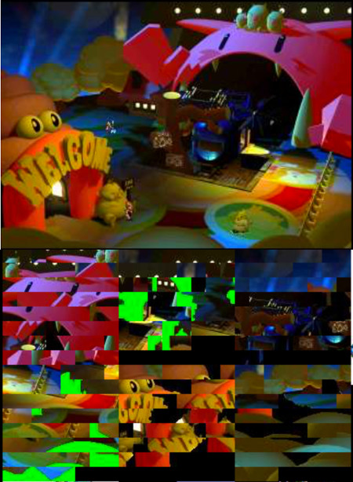

I wanted something more robust and flexible. I then had the idea to pre-render a [depth buffer](https://en.wikipedia.org/wiki/Z-buffering) along with the colored background. Provided that the camera in Blender and in the game and used the same [near and far planes](https://en.wikipedia.org/wiki/Viewing_frustum) the pre-rendered depth buffer would be just the same as if the scene had been rendered in real-time.

#### Depth Buffer

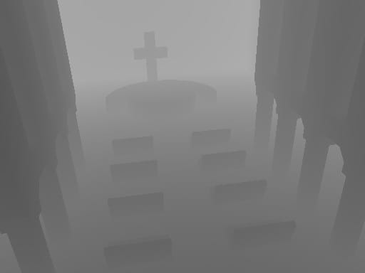

Coercing Blender to render a depth buffer was tricky since it isn't used for its raytracing renderer. The best I could do is create a linear depth buffer. However, OpenGL [does not uses a linear depth buffer](https://www.sjbaker.org/steve/omniv/love_your_z_buffer.html)
. It prioritizes higher precision for objects close to the camera and uses less precision for those far away. Just like floating point does with large and small values. This makes a lot of sense since you don't care as much about minuscule differences in depth, at long distances. 

The following snippet shows how the fragment shader renders both the color and depth values. The linear depth buffer values are scaled appropriately.

```GLSL
vec4 depth = texture(u_depth, v_uv);
    
float near = 0.5;
float far = 25.0;
float z_linear = depth.r;
    
float z_non_linear = -((near + far) * z_linear - (2.0 * near)) / ((near - far) * z_linear); 
gl_FragDepth = z_linear;
    
// Copy background color
vec4 color = texture(u_albedo, v_uv);
fragColor = color; 
```
I tried to create a post-process filter which would encode the depth buffer in Blender. Then the shader could copy directly into the depth buffer without transforming from linear, but for some reason, I couldn't get this precise enough to be satisfied with.

Some graphics hardware doesn't support writing to the depth buffer in a shader. Even OpenGL ES 2.0 requires an [extension](https://www.khronos.org/registry/OpenGL/extensions/EXT/EXT_frag_depth.txt). You may be able to accomplish something similar with [glColorMask](https://www.khronos.org/registry/OpenGL-Refpages/es2.0/xhtml/glColorMask.xml) and a fullscreen quad.

## Shadows

Shadows in real-time graphics [can be tricky](https://www.nvidia.com/object/doc_shadows.html). The dominant technique is [shadow mapping](https://en.wikipedia.org/wiki/Shadow_mapping) followed by Doom 3's [stencil shadow volumes](https://en.wikipedia.org/wiki/Shadow_volume). 

For this project, I had to consider which of these methods would be able to be combined with pre-rendered backgrounds. I had no insight into how this could work with shadow volumes. With shadow mapping, one may be able to pre-render the [shadow map](https://en.wikipedia.org/wiki/Shadow_mapping#/media/File:2shadowmap.png) of the detailed scenery from the perspective of each light. But, these depth maps must also be combined with the real-time objects in a similar way to the backgrounds. Since they could be rendered in high resolution and detail, this may provide a boost to shadow quality that is not possible in real-time. As far as I know, this could not have been done in the old games, and I encourage anyone interested in this idea to explore it.

I have been through the pains of writing shadow mapping and volumes in the past, so for this project, I wanted to use simple [planar projection](https://www.opengl.org/archives/resources/code/samples/mjktips/TexShadowReflectLight.html) instead. This involves flatting the model onto a plane with a transformation matrix and then filling it in with a dark color. Planar projection works well for showing a simple shadow underneath a character but has a lot of limitations. The most glaring is that the shadow cannot be cast on other scene objects. If you walk in front of a wall or obstacle, the shadow will leak on the other side. These limitations are just as apparent with pre-rendered backgrounds as they are in a real-time scene.

A simple improvement I made was to have the character cast two shadows instead of one. In each scene, one light is designated as the primary source and another as the secondary. The primary light casts a dark shadow while the secondary light casts a lighter one. This avoids some of the harsh looks that are typical of planar projection and makes the shadows look more lively.


## Reflections

If you look closely at the Astronaut's helmet and vest you will notice that it reflects the surrounding scene. Following the principle of matching the background and the game, I thought this was an essential effect for grounding the character in the scene. It also helps give the material of the visor an authentic look.

The reflections are done by rendering a [cubemap](https://learnopengl.com/Advanced-OpenGL/Cubemaps) that accompanies each background. I wrote a script for Blender which would orient the camera in all 6 directions and capture an image at each.

**Cubemap**

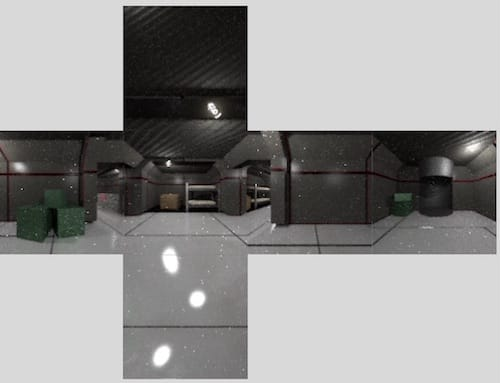

The cubemaps don't need to be very high resolution to give a nice looking effect. Even a 32-pixel wide map can make a big difference, and the rendering cost in a shader is almost negligible.

Here is the reflection code, which is fairly standard. The camera direction is simply reflected along the surface normal. This resulting vector is used to lookup a color in the cubemap.

```GLSL
vec3 viewDir = normalize(v_fragPosition - u_camPosition);

vec3 envVec = reflect(viewDir, normal);
vec3 envColor = texture(u_envMap, vec3(envVec.x, -envVec.y, envVec.z)).rgb;
```

## Scripting

Since the game was supposed to have a lot of interactive point-and-click objects, I thought scripting was important. The script system was inspired by [TSC](https://www.cavestory.org/guides/basicmodding/guide/tsc.txt), a language invented for [Cave Story](https://www.cavestory.org). I liked TSC because it is very simple and also very effective for scripting game events. Cave Story also has a lot of dialogue and scripted scenes which are similar in structure and level of complexity that I was going for.

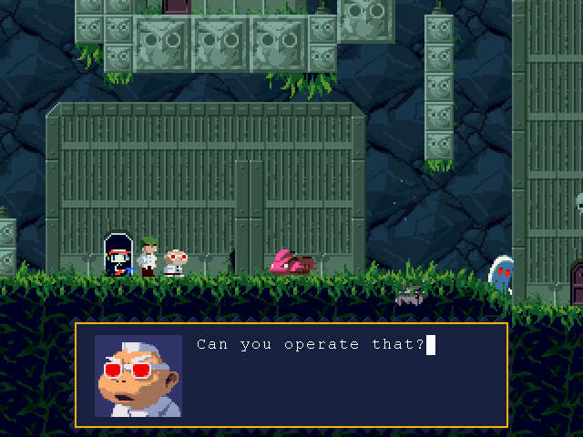

The language is structured like assembly, with no fancy runtime stack, containing only branch operations and event labels. Unlike a typical interpreted language, the script doesn't continue on immediately after executing an instruction. For example, playing a sound would wait until the sound is completed before moving on to the next step.

Here is a sample:

```
#0030
<PRI<FLJ0202:0032<FLJ0201:0031<FL+0201<GIT0005<AM+0005:0010
<CMU0010Got the =Missile Launcher=!<WAI0160<NOD<RMU<CLRThe Missile Launcher is a powerful
weapon, but its ammo is limited.<NOD
You can replenish your stockpile
with items dropped by enemies.<NOD<END
#0031
<PRI<AM+0005:0005<MSG
<GIT0006Max missiles increased by <NUM0000!<NOD<END
#0032
<PRI<AM+0010:0005<MSG
<GIT0011Max missiles increased by <NUM0000!<NOD<END
```

Cave Story has a global script loaded, and each level loads its own script. I was curious how this worked, so I contacted a Cave Story enthusiast:

> "At any given time there's actually only one script buffer which stores the "Active script", in plaintext. Normally, that would be the contents of Head.tsc with the current stage's script appended to the end of it. However, when you bring up the item menu, it actually replaces the contents of that buffer by loading ArmsItem.tsc - and likewise, it loads the head and stage scripts again when the menu is closed. Other than this, there's also a limiting factor in that the size of the script buffer is allocated on startup so if a script is too large the game will crash.

> When the game goes to run an event, it scans through the script from start to end looking for the event number. If it finds something that it thinks is an event number and is larger than what it's searching for, it stops immediately and assumes that the event couldn't be found. Thus, putting large event #s in head.tsc can lead to some unexpected behaviour."


Here is a sample of my inspired language:

```
#bathroom
    AMB "SOUND_TUNNEL"
    END

#hallway
    AMB "SOUND_GENERATOR"
    END

#bedroom
    AMB "SOUND_TUNNEL"
    END

#elevButton
    SND "SOUND_BEEP"
    CTL 0
    PATH "exit_waypoint"
    WPATH
    CTL 1
    SND "SOUND_BEEP"
    END
```

This was my first time designing an interpreted language, and unfortunately, I made a few mistakes. A major one was the lack of coroutines or the ability to maintain the state of the machine when calling into C code. For example, if script A triggers a game event which starts script B, then B takes control of the program counter and does not continue with A's sequence of events. I would need to rewrite it before it was usable. Maybe I'll try Forth.

## Backgrounds

Since we could take a lot of time to render the backgrounds, we used the [Blender Cycles engine](https://www.cycles-renderer.org). Blender now prefers that materials are composed procedurally, rather than with hand-painted textures. Cycles can simulate these materials more accurately while making them more reusable and clear at multiple viewing distances. 

Hunter and I both were unfamiliar with this kind of material system and the node based editor, so we had to do a lot of experimentation and [reading](https://www.blenderguru.com/articles/cycles-shader-encyclopedia).

**Graph for a material**

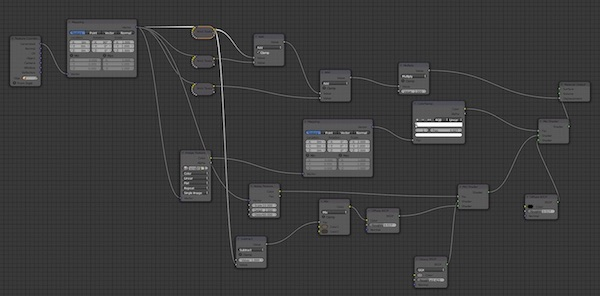

Below is an early scenery test we made. I don't think we ever quite got the hang of combining the base shaders to produce the materials we wanted, but we were especially proud of the floor material.

**Scenery mockup**

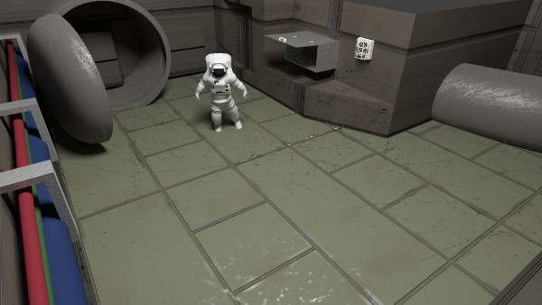

## Character

Since most of the graphics budget could be allocated for the characters, we could put a lot more detail into them than would be conventional. Since this was a tablet game, we budgeted 4-5k triangles for each character, along with sophisticated materials with 2048x2048 textures. Even at that conservative resolution, each individual triangle only occupies a few pixels on the screen, so there isn't much sense in taking it further, even though it could.

Hunter modeled one side of the astronaut first and then mirroring it across. I told Hunter this would be a good technique for maximizing texture usage. However, I found out later that this completely breaks normal maps. But, it is still helpful for modeling and UV mapping. We fixed this by separating the UV maps after mirroring such that none of the pieces overlap.

**UV Mapping**

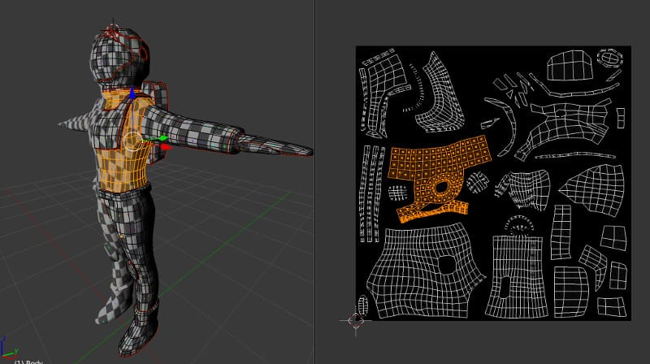

After mirroring, Hunter added a few asymmetric pieces, such as the hose connecting his backpack and vest.

When the in-game mesh was finished, the astronaut was subdivided a few times to create an extra high-res version. Hunter then sculpted the high-res model to create the cloth and small details in the equipment. ZBrush and Mudbox are the standard tools for doing this, but Blender sculpt worked just fine for our needs.

**High-res sculpt**

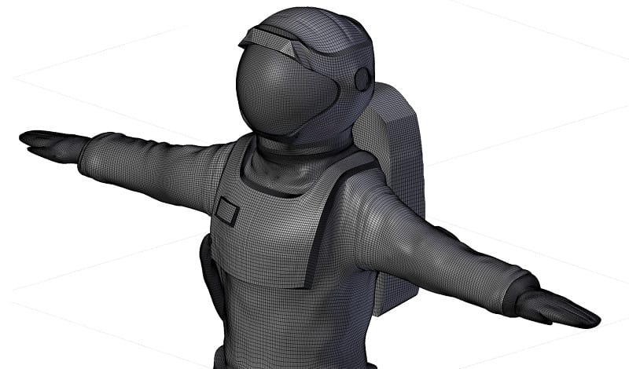

This is a standard technique for generating normal maps. The normals from the high-res mesh are baked on to the low-res surface. You can learn more about how to use this technique from [Making of Varga](http://www.paultosca.com/makingofvarga.html).

To finish off the material, we created a specular map, which controls the color and intensity of specular reflections, and a gloss map, which controls how shiny each surface appears. The normal map makes the most significant difference overall, but these others are important for making each part of the model look like its intended material. 

This material model was popular for PS3 and Xbox-360 games but has since been replaced by [physically based rendering](https://marmoset.co/posts/physically-based-rendering-and-you-can-too/) which has a lot of production advantages along with being more correct.


**All 4 astronaut texture maps**

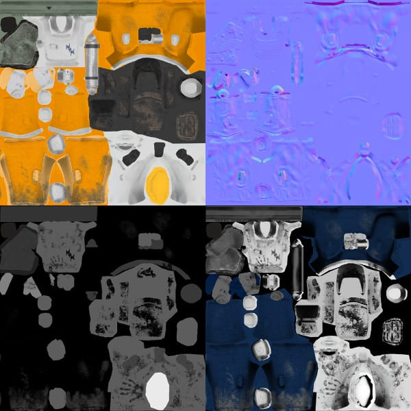

The last step before animating the character is creating a skeleton. This is fun, except the tedious part of assigning vertices to each bone. A nice touch Hunter added is a bone to bend the backpack tube.

**Astronaut rig**

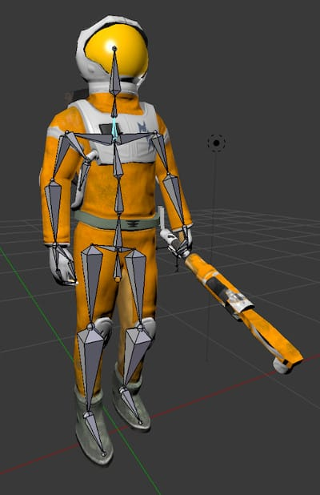

To summarize, to get just one character ready for animation, we had to:

1. Sketch a concept
2. Create a low-res model.
3. UV unwrap the low-res model.
4. Generate a high-res model.
5. Sculp the high-res model.
6. Bake normal maps.
7. Paint texture map.
8. Paint specular map.
9. Paint gloss map.
10. Create a rig.
11. Bind mesh to the rig and paint weights.

As you can imagine, this takes quite a bit of time, and since it was Hunter's first time, there was a lot of learning along the way and parts he wishes he could go back and change. 

## The Future

Since pre-rendered backgrounds are no longer popular, there are not many resources to learn from. 
We hope that this article will rejuvenate some interest in the subject and help other game developers work with them in the future.

Hunter and I have moved on to other projects, but we are still interested in the game concept and the technology and are excited to hear others' ideas.

The [source code](https://github.com/justinmeiners/pre-rendered-backgrounds) for the engine is GPL and is fully capable of being used in other games of different genres. Contact us if you are interested in an alternative license.

### Bonus: Comic Book Concept

Towards the end of the project, I was messing around with some toon style shading and came up with this render:

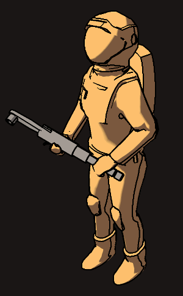

That looked like a more exciting direction to take the art. The end goal of hyper-detailed rendering would be grungey realism. But, what if we turned that around and used pre-rendered backgrounds to make something unrealistic? What if the entire game looked like a comic book, including dialog bubbles and panels?  

You could even model the levels with simple shapes to define the perspective and depth, and then hand paint the scenery on top!

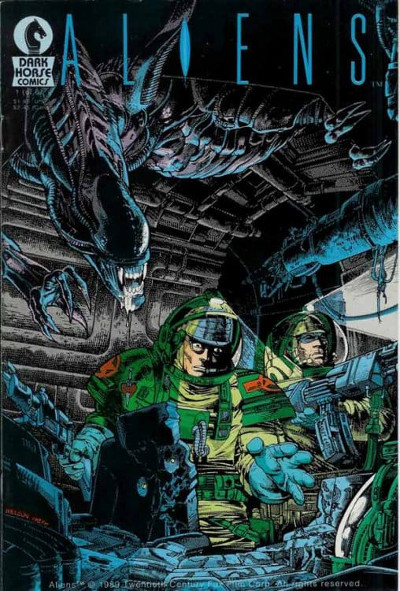

## Additional References

* [3D Lighting Tutorial](http://www.amaanakram.com/lightingT/part1.htm)

* [Art Tutorial](http://androidarts.com/art_tut.htm)

* [Graphics Tech: Precomputed Lighting](http://the-witness.net/news/2010/03/graphics-tech-precomputed-lighting/)

* [Image Based Lighting](http://blog.hvidtfeldts.net/index.php/2012/10/image-based-lighting/)

* [Low Poly Game Character Hair](http://www.paultosca.com/varga_hair.html)

* [The Cabal: Valve's Design Process for Creating Half-Life](https://www.gamasutra.com/view/feature/131815/the_cabal_valves_design_process_.php)

* [Zelda: Wind Waker Tech and Texture Analysis](http://polycount.com/discussion/104415/zelda-wind-waker-tech-and-texture-analysis-picture-heavy)
